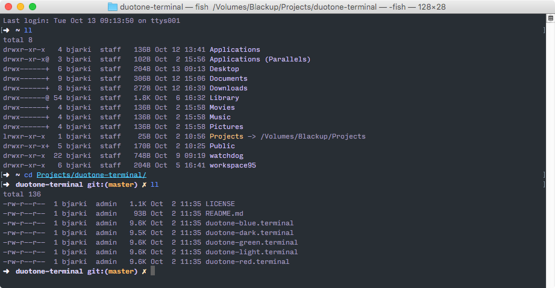
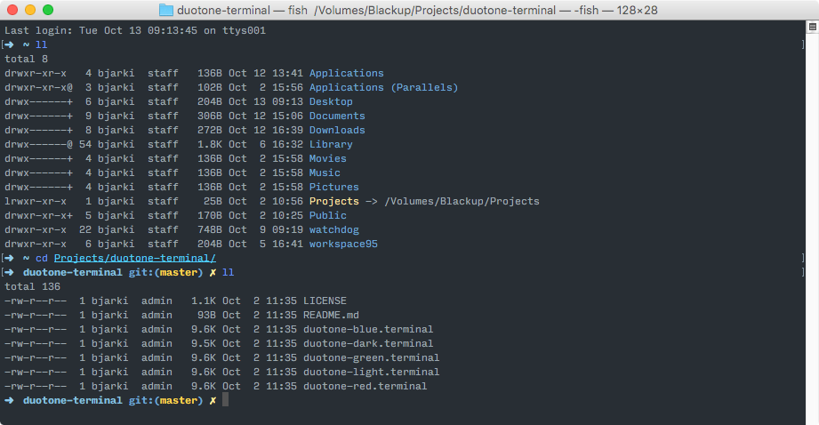
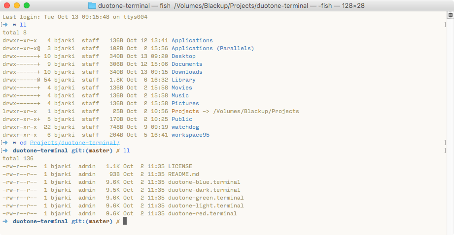
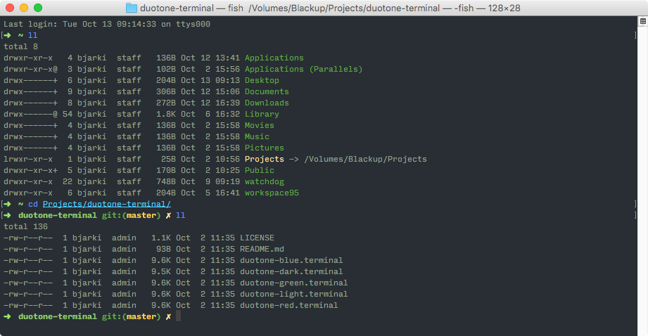
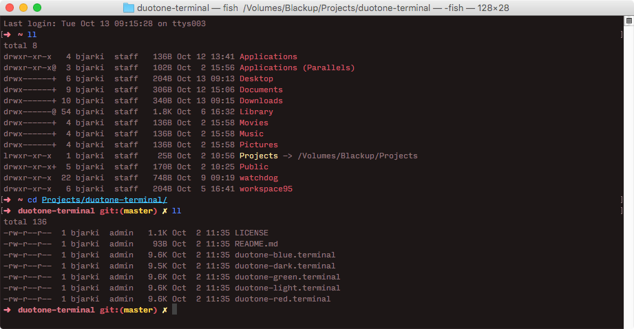

# duotone-terminal
An OS X terminal version of the Duotone color schemes for the Atom editor by simurai

https://atom.io/themes/duotone-dark-syntax

# Screenshots

## Duotone Dark

## Duotone Blue

## Duotone Light

## Duotone Green

## Duotone Red

